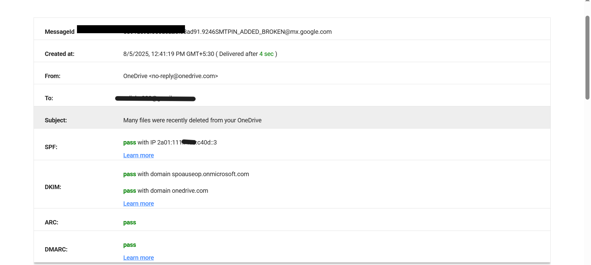
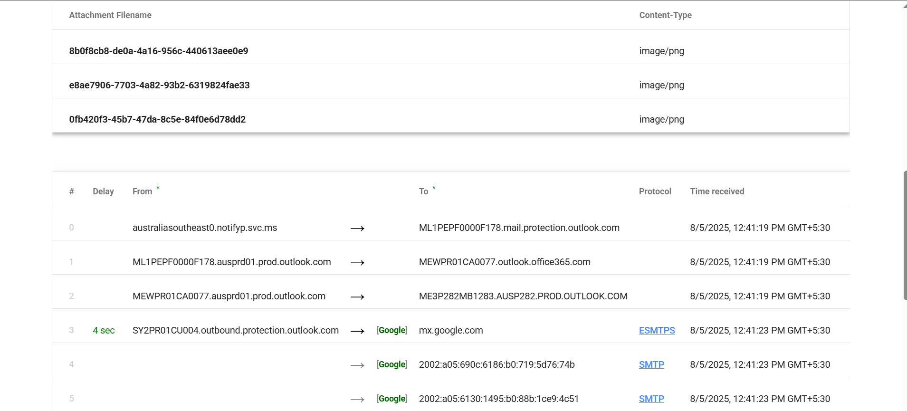

# 📄 Phishing Email Analysis Report

**Internship Task 2**  
📅 **Date:** August 5, 2025  
🎯 **Objective:** Analyze a suspicious email sample and identify phishing characteristics.

---

## 🧰 Tools Used

- **Email Header Analyzer**: Google Admin Toolbox  
  ([https://toolbox.googleapps.com/apps/messageheader/](https://toolbox.googleapps.com/apps/messageheader/))
- Manual inspection of header and email body

---

## ✉️ Email Details

| Field | Value |
|-------|-------|
| **From** | `no-reply@onedrive.com` |
| **To** | [Redacted for Privacy] |
| **Subject** | "Many files were recently deleted from your OneDrive" |
| **Attachments** | 3 PNG images |
| **Delivery Time** | Delivered in 4 seconds |
| **Email Service** | Microsoft Outlook → Google Mail transfer observed |

---

## 📤 Authentication Results

| Authentication Method | Result | Notes |
|-----------------------|--------|-------|
| **SPF** | ✅ Pass | IP authorized by sender domain |
| **DKIM** | ✅ Pass | Matches `onedrive.com` and `onmicrosoft.com` |
| **DMARC** | ✅ Pass | Passed domain policy check |
| **ARC** | ✅ Pass | Authenticated Received Chain verified |

---

## 🔍 Header Analysis Screenshots

-   
- 

---

## 🧪 Phishing Indicators Checklist

| Indicator | Present? | Comments |
|-----------|----------|----------|
| **Spoofed sender domain** | ❌ No | Domain is verified and matches official Microsoft service |
| **Failed SPF/DKIM/DMARC** | ❌ No | All passed |
| **Mismatched links or suspicious URLs** | ❌ No | Not observed |
| **Urgent/Threatening language** | ❌ No | Informative subject, no urgency tone |
| **Poor grammar or spelling errors** | ❌ No | Professional content |
| **Unexpected or risky attachments** | ⚠️ Possibly | PNG images — may require further checking |

---

## 🧠 Conclusion

Based on the analysis of the email header and message characteristics:

- All email authentication protocols (SPF, DKIM, DMARC) passed successfully.
- The sender domain appears to be from Microsoft, not spoofed.
- No signs of phishing tone, malicious links, or poor grammar.

> ✅ **Verdict:** This is a **legitimate system notification email** from OneDrive/Microsoft.

---

**Analyst:** Disha Varshney  
**Submission Mode:** GitHub Repository (Cybersecurity Internship Task)
